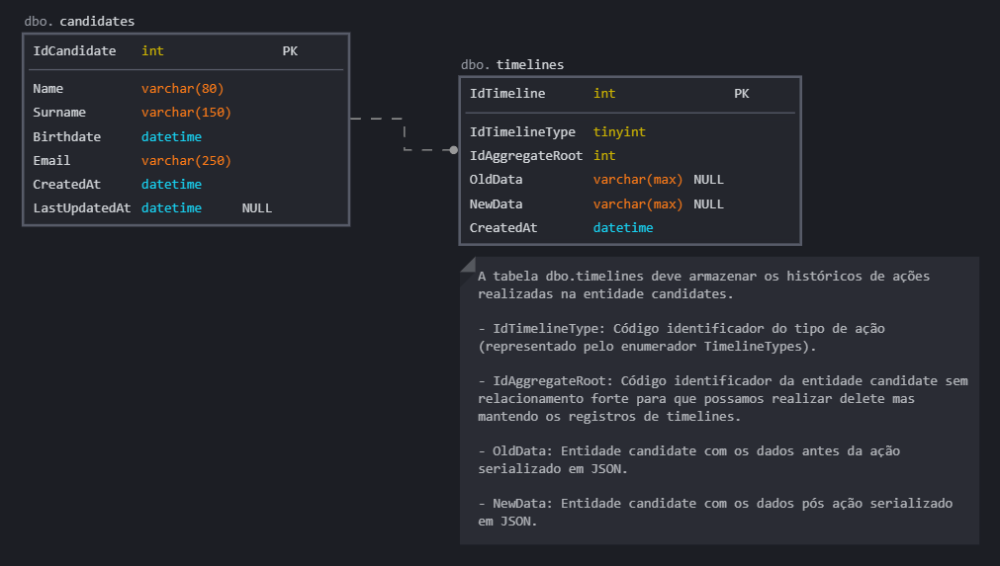

# Avaliação ASP.NET (API + EF + CQRS + DDD + Docker + Tests)

## Requisitos de negócio

Nossa equipe de frontend está desenvolvendo uma aplicação web que possibilita que recrutadores possam gerenciar a base de candidatos da empresa.
Sua missão é desenvolver um projeto do tipo WebAPI que possibilite que nossa equipe de frontend implemente as seguintes ações na UI:

- Consultar a lista de candidatos cadastrados.
- Cadastrar novos candidatos.
- Editar o cadastro de um candidato.
- Excluir um candidato.

Nosso sistema passa por auditorias frequentes e precisamos armazenar todas as ações realizadas pelos recrutadores.

Portanto ao cadastrar, editar ou excluir é necessário registrar uma timeline identificando a ação através de `IdTimelineType`,
também precisamos armazenar em formato string (JSON) nas colunas `OldData` e `NewData` os dados antigos e novos do candidato, respectivamente.

## Requisitos técnicos
- Desenvolva um projeto de WebAPI utilizando .NET Core 7.
- Implemente o padrão arquitetural CQRS (com o package MediatR ou similares).
- Implemente registro de timelines utilizando publicação/disparo de eventos.
- Implemente o padrão Repository & Unit Of Work Pattern.
- Desenvolva com base no modelo relacional apresentado.
- Desenvolva utilizando a abordagem de Code-First.
- Utilize o EF Core como ORM para consultas e persitência de dados.
- Utilize banco de dados Microsoft SQL Server através do Docker (modifique arquivos compose se achar necessário).
- Cria ou modifique as camadas/projetos que julgar necessário.
- Implemente os testes unitários e funcionais que julgar necessário.

## Como iniciar
- Faça um fork deste repositório.
- Ao finalizar o seu desenvolvimento, submeta um pull request para este repositório.

## Dicas
- Não é necessário implementar autenticação/autorização (JWT)
- Aplique os seus conhecimentos e boas práticas de OOP, DDD, SOLID e Clean Code.
- Não existe certo ou errado, o nosso objetivo é conhecer o seu estilo de programação.
